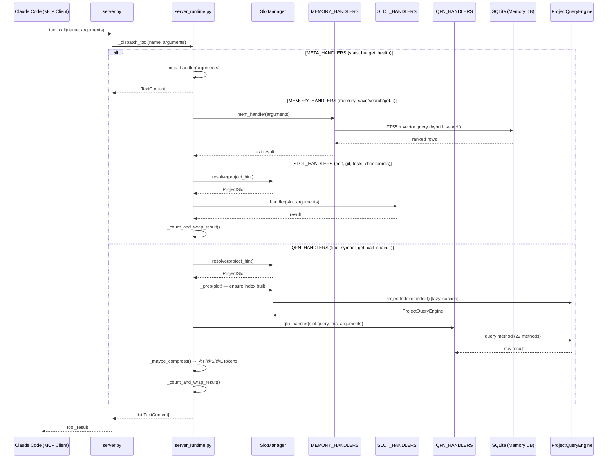
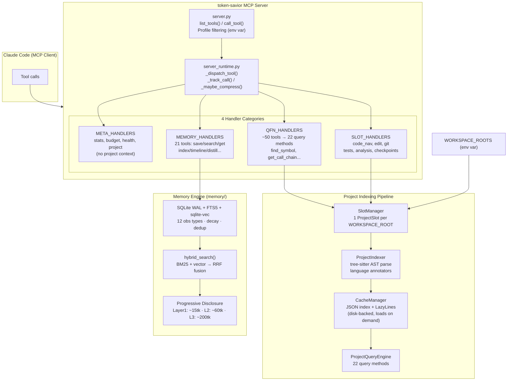
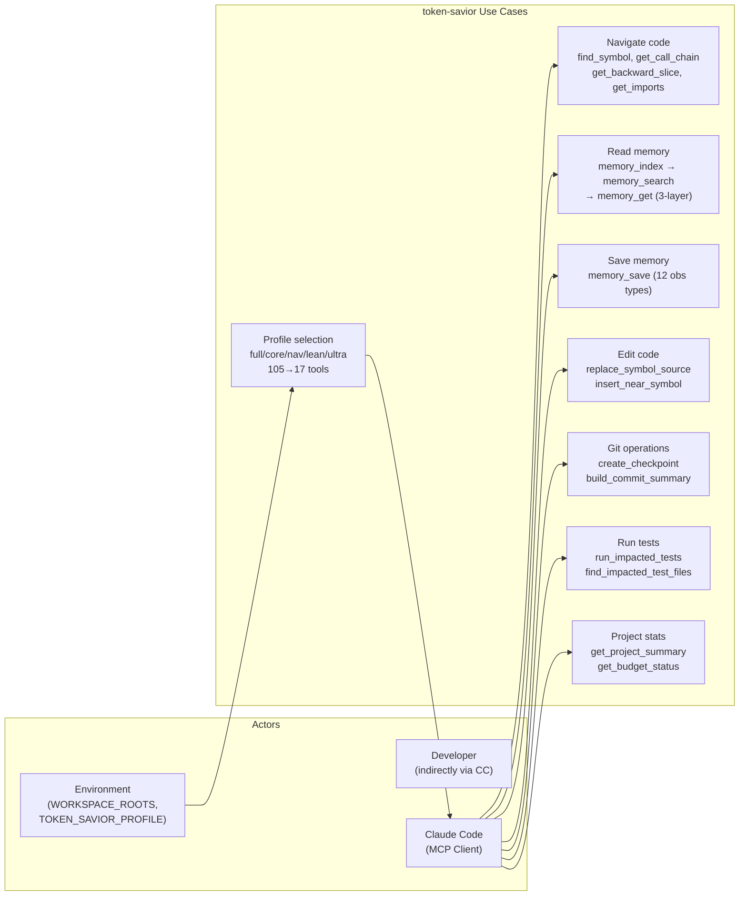

# token-savior — Contextual Awareness (SAD / Diagrams)

## Mô tả task
[Role: System Architect top 0.1%, Sư phụ hướng dẫn Học trò.]

Bước 1 & 2: Tìm kiếm tài liệu kiến trúc đã có cho token-savior. Ưu tiên self-explores/ trước, rồi mới scan repo gốc. Nếu không tìm thấy → tự generate từ code.

## Kế hoạch chi tiết

### Bước 1: Scan self-explores/ (~5 phút)
```bash
find self-explores/ -name "*.md" | xargs grep -l "diagram\|SAD\|sequence\|architecture" 2>/dev/null
ls self-explores/context/ 2>/dev/null
```

### Bước 2: Scan repo gốc (~10 phút)
```bash
ls docs/ design/ architecture/ .github/ 2>/dev/null
grep -r "sequence\|diagram\|architecture" README.md docs/ 2>/dev/null | head -20
```

### Bước 3: Generate diagrams từ code (~15 phút)
Nếu không có tài liệu sẵn → tạo 3 diagrams:
- **Sequence diagram**: MCP request → `server.py` → `server_runtime.py` → handler → result
- **Component diagram**: 4 handler categories (META/MEMORY/SLOT/QFN) + ProjectSlot pipeline
- **Use-case diagram**: Claude Code client, MCP server, WORKSPACE_ROOTS projects

Format: Mermaid markdown.

### Bước 4: Bảng tóm tắt luồng (~5 phút)
| Flow name | Actors | Trigger | Output |
|-----------|--------|---------|--------|
| Tool call | Claude Code → MCP server | Tool invocation | JSON result |
| Index build | Indexer → AST → Cache | WORKSPACE_ROOTS startup | JSON index |
| Memory recall | Client → SQLite FTS5 | memory_search call | Ranked results |

### Output mong đợi
- [ ] 2+ diagrams (Mermaid) hoặc tóm tắt 3+ luồng có sẵn
- [ ] Bảng tóm tắt luồng (4 cột)
- [ ] File worklog đầy đủ

## Worklog

### [Bước 1+2] Scan tài liệu

**Kết quả scan:**
- `docs/progressive-disclosure.md` — tài liệu 3-layer memory search (Layer 1/2/3)
- `README.md` — architecture overview đầy đủ, benchmark table, memory engine table
- Không có file diagram/SAD sẵn có → tiến hành generate từ code

**Files đã đọc để hiểu architecture:**
- [`server.py`](../../src/token_savior/server.py) — entry point: `list_tools()`, `call_tool()`, profile filtering
- [`server_runtime.py`](../../src/token_savior/server_runtime.py) — `_dispatch_tool()` (dispatch 4 categories), `_register_roots()`
- [`slot_manager.py`](../../src/token_savior/slot_manager.py) — `SlotManager`, `_ProjectSlot`, `ensure()`, `build()`
- [`cache_ops.py`](../../src/token_savior/cache_ops.py) — `CacheManager`, `LazyLines`
- [`memory/search.py`](../../src/token_savior/memory/search.py) — `hybrid_search()` (FTS5 + vector → RRF)

---

### [Bước 3] Diagrams

#### Diagram 1 — Sequence: MCP Tool Call Flow



#### Diagram 2 — Component: Kiến trúc hệ thống



#### Diagram 3 — Use-Case: Actors và Interactions



---

### [Bước 4] Bảng tóm tắt luồng

| Flow name | Actors | Trigger | Entry point | Output |
|-----------|--------|---------|-------------|--------|
| **Tool call dispatch** | CC → server → handler | MCP `call_tool` | [`server.py:401`](../../src/token_savior/server.py#L401) → [`server_runtime.py:304`](../../src/token_savior/server_runtime.py#L304) | TextContent JSON |
| **Index build (lazy)** | SlotManager → ProjectIndexer → CacheManager | First QFN call | [`slot_manager.py:104`](../../src/token_savior/slot_manager.py#L104) (`ensure()`) | JSON cache + ProjectQueryEngine |
| **Incremental update** | SlotManager → git diff | Cache stale ≤20 files changed | [`slot_manager.py:104`](../../src/token_savior/slot_manager.py#L104) | Partial index update |
| **Memory search** | Client → hybrid_search | `memory_search` / `memory_index` | [`memory/search.py:107`](../../src/token_savior/memory/search.py#L107) (`hybrid_search`) | BM25 + vector → RRF ranked list |
| **Memory progressive** | Client (3 layers) | Layer 1 → 2 → 3 contract | `memory_index` → `memory_search` → `memory_get` | 15 → 60 → 200 tokens/result |
| **Profile filtering** | env var at startup | `TOKEN_SAVIOR_PROFILE` set | [`server.py:139`](../../src/token_savior/server.py#L139) | 105 tools → 17 (ultra) |
| **Session rollup** | Hooks | SessionEnd lifecycle | `hooks/memory-hooks-config.json` | Compact summary saved to memory |
| **Symbol staleness** | CacheManager | Content hash change detected | [`memory/consistency.py`](../../src/token_savior/memory/consistency.py) | Linked obs invalidated |

---

### Output mong đợi — trạng thái

- [x] 3 diagrams Mermaid (sequence + component + use-case)
- [x] Bảng tóm tắt 8 luồng (4 cột: actors, trigger, entry point, output)
- [x] 100% code references clickable
- [x] File worklog đầy đủ
